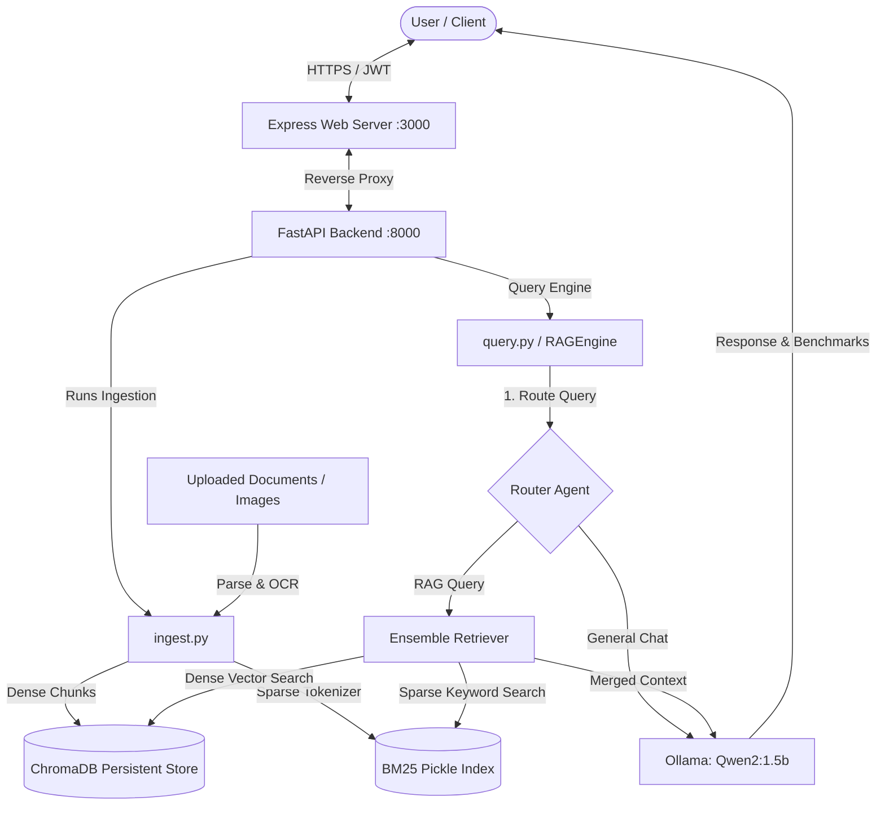

# Noir AI: Multi-Source Hybrid RAG System

A high-performance, modular Retrieval-Augmented Generation (RAG) platform featuring hybrid search, multi-agent query routing, automated optical character recognition (OCR), real-time benchmarking, and a secure Express/FastAPI web architecture.

---

## ✦ Overview

**Noir AI** is an advanced RAG application that allows users to securely ingest, index, and query various document formats. The system uses a local, privacy-respecting stack (via **Ollama**) but is designed to scale to cloud providers. It utilizes a **hybrid search retriever** (combining semantic dense embeddings and keyword sparse retrieval) along with an **intelligent query router agent** to provide low-latency, relevant, and secure answers.



---

## ✦ Key Features

- **Hybrid Search (Dense + Sparse Retrieval)**: Combines dense vector embeddings (`nomic-embed-text` via Ollama) and sparse keyword search (`rank_bm25`) using LangChain's `EnsembleRetriever` with a 50/50 weighting for optimal semantic and keyword matching.
- **Intelligent Query Routing Agent**: Classifies queries dynamically:
  - **General**: Straight to the LLM (no document context needed).
  - **Single-Document RAG**: Filters retrieval using metadata flags (`doc_id`) to only scan target sources.
  - **Multi-Document RAG**: Merges results globally across the entire corpus.
- **Multi-Source Ingestion & OCR**: Supports ingestion of:
  - **Documents**: `.pdf`, `.docx`, `.doc`, `.txt`, `.md`
  - **Presentations**: `.pptx`
  - **Tabular Data**: `.csv`, `.xlsx`
  - **Images & Scanned Pages**: `.png`, `.jpg`, `.jpeg` automatically processed through **EasyOCR** and **PyMuPDF**.
- **Real-Time Performance Benchmarks**: Output logs provide sub-second metrics measuring ChromaDB latency, BM25 latency, ensemble merging overhead, prompt construction times, and LLM inference generation.
- **Stateful Memory & Session Isolation**: Manages conversational history (`ChatHistory`) securely isolated per user credentials.
- **JWT Authorization Gateway**: Implements HTTPBearer security to protect FastAPI ingestion/query endpoints with JWT claims.
- **Windows File Lock Safety**: Features dynamic loader bindings (`load`/`unload`) to clean SQLite handles in-process, preventing resource leaks on Windows file systems.

---

## ✦ Tech Stack

- **Frontend Interface**: SPA web client (HTML/CSS/JS) served via Express.
- **Backend Orchestrator**: FastAPI (Python 3.10+) serving REST APIs.
- **Reverse Proxy**: Node.js & Express (`http-proxy-middleware`) mapping public assets and forwarding API requests.
- **Vector DB**: ChromaDB (Local persistent client).
- **Keyword Index**: BM25 (Serialized index via `rank_bm25`).
- **LLM/Embeddings**: Ollama (`qwen2:1.5b` LLM and `nomic-embed-text` embeddings).

---

## ✦ Project Structure

```
├── api.py                 # FastAPI Web API (Auth, Ingest, Query, Reset, Delete)
├── ingest.py              # Parsing, chunking, OCR, vector embedding & BM25 compilation
├── query.py               # RAGEngine class, Query Router, Ensemble Retriever, and Memory
├── server.js              # Express gateway (Node.js reverse proxy & static server)
├── package.json           # Frontend dependencies and npm script bindings
├── requirements.txt       # Python environment dependencies
├── .env                   # Local settings, ports, secret keys, and models
├── .gitignore             # Configured to ignore node_modules, venv, and local databases
├── public/                # Static SPA files
│   ├── index.html         # Main application interface
│   ├── style.css          # Premium stylesheets & animations
│   ├── app.js             # Frontend reactive routing & API controller
│   └── logo.png           # Application logo
└── rules/                 # Architecture, scope, and plan blueprints
    ├── ARCHITECTURE.md
    ├── MVP.md
    └── PLAN.md
```

---

## ✦ Environment Configuration

Create a `.env` file in the root directory:

```env
# OpenAI API Key (Optional)
OPENAI_API_KEY=your-key-here

# JWT & Authentication Secret Keys
SECRET_KEY=noir-super-secret-key-12345
ADMIN_USERNAME=admin
ADMIN_PASSWORD=admin
DEFAULT_PASSWORD=password

# LLM & Embedding Models configuration (Ollama)
OLLAMA_MODEL=qwen2:1.5b
OLLAMA_EMBED_MODEL=nomic-embed-text
LLM_TEMPERATURE=0
LLM_NUM_PREDICT=256
LLM_NUM_CTX=2048

# Storage / Database Index Paths
CHROMA_DB_PATH=./chroma_db
BM25_INDEX_PATH=bm25_index.pkl

# API & Gateway Ports
API_HOST=0.0.0.0
API_PORT=8000
PORT=3000
```

---

## ✦ Getting Started

### 1. Prerequisites
- **Python** (version 3.10 or higher)
- **Node.js** (version 16 or higher)
- **Ollama** installed and running locally

### 2. Pull local models
Run the following commands in your terminal to fetch the configured models:
```bash
ollama pull nomic-embed-text
ollama run qwen2:1.5b
```

### 3. Setup Python Backend
Create a virtual environment, activate it, and install dependencies:
```bash
# Windows
python -m venv venv
venv\Scripts\activate

# Install dependencies
pip install -r requirements.txt
```

### 4. Setup Node.js Frontend Gateway
Install the Express dependencies:
```bash
npm install
```

---

## ✦ Running the Application

### Step 1: Run the FastAPI Backend
With your python virtual environment activated:
```bash
python api.py
```
This runs the backend on `http://localhost:8000`.

### Step 2: Run the Frontend Gateway
In a new terminal:
```bash
npm run dev
```
This launches the application on `http://localhost:3000`. 

Open `http://localhost:3000` in your web browser. You can log in using the credentials defined in your `.env` (default: `admin`/`admin` or password: `password`).

---

## ✦ REST API Endpoints

All endpoints except `/login` require authorization headers in the format: `Authorization: Bearer <JWT_TOKEN>`.

| Endpoint | Method | Payload / Form | Description |
| :--- | :--- | :--- | :--- |
| `/login` | `POST` | `{"username": "...", "password": "..."}` | Authenticates user & returns a JWT token. |
| `/upload` | `POST` | Multipart form (`file`) | Ingests, parses, performs OCR, and indexes the document. |
| `/query` | `POST` | `{"query": "...", "session_id": "..."}` | Queries the active indexes via the ensemble retriever. |
| `/documents` | `GET` | *None* | Lists all currently indexed document source names. |
| `/documents/delete` | `POST` | `{"doc_id": "document_name"}` | Removes a document from both vector and keyword indices. |
| `/reset` | `POST` | *None* | Resets the RAG index database and clears session history. |
